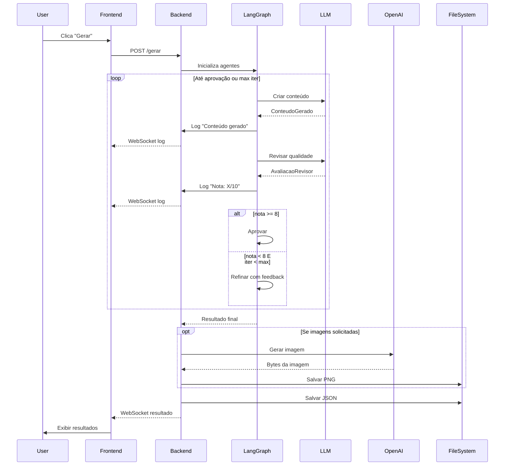

# 🏗️ Project Overview - Marketing AI System

## 📊 Visão Técnica Completa

Este documento fornece uma visão detalhada da arquitetura, componentes e decisões técnicas do projeto.

---

## 🎯 Objetivo do Projeto

Automatizar a criação de conteúdos de marketing digital de alta qualidade para produtos educacionais da Hotmart, usando um sistema de agentes de IA com loop de qualidade.

---

## 🏛️ Arquitetura Geral

```
┌─────────────────────────────────────────────────────┐
│                  Frontend (Browser)                  │
│  ┌──────────┐  ┌──────────┐  ┌──────────────────┐  │
│  │  HTML5   │  │   CSS3   │  │  JavaScript ES6  │  │
│  │(Jinja2)  │  │(Modern)  │  │  + WebSocket     │  │
│  └──────────┘  └──────────┘  └──────────────────┘  │
└────────────────────┬────────────────────────────────┘
                     │ HTTP/WebSocket
                     ▼
┌─────────────────────────────────────────────────────┐
│              Backend (FastAPI/Python)                │
│  ┌──────────────────────────────────────────────┐  │
│  │           API Routes & WebSocket              │  │
│  │  • /         (HTML interface)                 │  │
│  │  • /ws       (WebSocket logs)                 │  │
│  │  • /gerar    (Generation endpoint)            │  │
│  │  • /download (File downloads)                 │  │
│  └──────────────────┬───────────────────────────┘  │
│                     │                                │
│  ┌──────────────────▼───────────────────────────┐  │
│  │         LangGraph Agent System               │  │
│  │  ┌────────────┐    ┌──────────┐             │  │
│  │  │  Criador   │───▶│ Revisor  │             │  │
│  │  │   (LLM)    │◀───│  (LLM)   │             │  │
│  │  └────────────┘    └──────────┘             │  │
│  │         │                 │                   │  │
│  │         └────────┬────────┘                   │  │
│  │                  ▼                            │  │
│  │           [nota >= 8?]                        │  │
│  │                  │                            │  │
│  │          ┌───────┴────────┐                  │  │
│  │          ▼                ▼                   │  │
│  │      [Salvar]       [Refinar]                │  │
│  └──────────────────────────────────────────────┘  │
│                     │                                │
│  ┌──────────────────▼───────────────────────────┐  │
│  │          External APIs                        │  │
│  │  • Anthropic (Claude)                         │  │
│  │  • OpenAI (GPT-4 + DALL-E)                    │  │
│  │  • Google (Gemini + Imagen)                   │  │
│  │  • DeepSeek                                   │  │
│  └───────────────────────────────────────────────┘  │
└─────────────────────────────────────────────────────┘
                     │
                     ▼
            ┌────────────────┐
            │   File System  │
            │  outputs/...   │
            └────────────────┘
```

---

## 📦 Componentes Principais

### 1. Backend (FastAPI)

**Arquivo:** `app.py`

**Responsabilidades:**
- Servir interface HTML
- Gerenciar WebSocket para logs em tempo real
- Orquestrar geração de conteúdos
- Gerar imagens via APIs externas
- Salvar resultados em JSON e arquivos

**Endpoints:**
- `GET /` - Interface principal
- `WebSocket /ws` - Logs em tempo real
- `POST /gerar` - Iniciar geração
- `GET /download/{folder}/{filename}` - Download de arquivos

**Tecnologias:**
- FastAPI 0.115+
- Uvicorn (ASGI server)
- WebSocket
- Jinja2 templates
- Async/await para operações I/O

---

### 2. Sistema de Agentes (LangGraph)

**Arquivo:** `agents.py`

**Classe Principal:** `MarketingAgents`

**Fluxo de Estados:**

```python
AgentState = {
    'config': ConfigGerador,
    'conteudo': ConteudoGerado | None,
    'avaliacao': AvaliacaoRevisor | None,
    'iteracao_atual': int,
    'logs': list[str],
    'timestamp': str
}
```

**Nós do Grafo:**

1. **criar_conteudo**
   - Usa LLM com structured output (Pydantic)
   - Gera todos os conteúdos de uma vez
   - Considera feedback se houver

2. **revisar_conteudo**
   - Avalia qualidade com 5 critérios
   - Retorna nota 0-10
   - Fornece feedback específico
   - Aprova se nota >= 8

3. **finalizar**
   - Encerra o processo
   - Retorna resultado final

**Transições:**
```
criar_conteudo → revisar_conteudo → [condicional]
                                        │
                            ┌───────────┴─────────────┐
                            ▼                         ▼
                    nota >= 8 OU                  nota < 8 E
                    iter >= max                   iter < max
                            │                         │
                            ▼                         ▼
                      finalizar               criar_conteudo
                                               (com feedback)
```

**LLM Providers:**
- Anthropic Claude Sonnet 4.5 (recomendado)
- OpenAI GPT-5
- Google Gemini 2.5 Plus
- DeepSeek v3
- Grok 2.0
- Qwen QwQ-32B-Preview
- Extensível para novos providers

---

### 3. Modelos de Dados (Pydantic)

**Arquivo:** `models.py`

**Modelos Principais:**

```python
class ConteudoGerado(BaseModel):
    """Saída estruturada do agente criador"""
    tipo_material: Literal[...]
    desc_hotmart: str  # max 1800 chars
    artigo: str        # HTML completo
    legenda: str
    nome_criativo: str  # max 50 chars
    desc_pv: str       # max 150 chars
    extra: Optional[str]

class AvaliacaoRevisor(BaseModel):
    """Saída estruturada do agente revisor"""
    nota: float  # 0-10
    feedback: Optional[str]
    aprovado: bool
    # Breakdown
    clareza: float      # 0-2
    persuasao: float    # 0-2
    criatividade: float # 0-2
    adequacao: float    # 0-2
    conversao: float    # 0-2

class ConfigGerador(BaseModel):
    """Configuração de entrada"""
    radical: str
    insumos: str
    max_iteracoes: int = 3
    llm_provider: str = "anthropic"
    image_provider: str = "openai"
    # Checkboxes
    gerar_tipo_material: bool = True
    gerar_desc_hotmart: bool = True
    # ... outros flags

class ResultadoFinal(BaseModel):
    """Resultado salvo em JSON"""
    data_geracao: str
    id_conteudos: str  # UUID 10 chars
    tipo_material: str
    # ... todos os conteúdos
    nota_conteudo: float
    iteracoes_realizadas: int
    qualidade_pendente: bool
```

**Validações:**
- Tipo checking automático
- Limites de caracteres
- Campos obrigatórios vs opcionais
- Valores literais para enums

---

### 4. Frontend

**Arquivos:**
- `templates/index.html` - Estrutura
- `static/style.css` - Estilos
- `static/script.js` - Lógica

**Funcionalidades:**

**HTML:**
- Formulário de configuração
- Checklist de conteúdos
- Área de logs
- Visualizador de resultados com tabs
- Sistema de download

**CSS:**
- Variáveis CSS customizáveis
- Design moderno e clean
- Responsivo (mobile-first)
- Animações suaves
- Tema profissional

**JavaScript:**
- Gerenciamento de WebSocket
- Validação de formulário
- Atualização de UI em tempo real
- Sistema de tabs
- Downloads de arquivos
- Prevent leave durante processamento

---

## 🔄 Fluxo de Execução Detalhado

### 1. Inicialização

```
Usuário acessa → FastAPI serve HTML → 
JavaScript conecta WebSocket →
Estado: "Pronto"
```

### 2. Configuração

```
Usuário preenche formulário:
├─ Radical (ex: dAdm)
├─ Insumos (texto base)
├─ Seleciona provider LLM
├─ Marca checkboxes
└─ Define max iterações
```

### 3. Geração (Assíncrono)



### 4. Revisão e Refinamento

```python
# Primeira iteração
criar_conteudo() → conteudo_v1
revisar_conteudo(conteudo_v1) → nota=6.5, feedback="Pouco persuasivo"

# Segunda iteração (com feedback)
criar_conteudo(feedback="Pouco persuasivo") → conteudo_v2
revisar_conteudo(conteudo_v2) → nota=8.2, aprovado=True

# Finalizar
salvar(conteudo_v2)
```

### 5. Salvamento

```
outputs/
└── 20251110_203000_a1b2c3d4e5/
    ├── conteudo.json
    └── imagens/
        ├── dAdm_MapasMentais_Vert_20251110.png
        └── dAdm_MapasMentais_Quad_20251110.png
```

---

## 🔑 Decisões Técnicas

### Por que LangGraph?

✅ **Vantagens:**
- Controle fino sobre fluxo de agentes
- Estado compartilhado entre nós
- Fácil adicionar novos nós/transições
- Logging e debugging integrados
- Suporte nativo a múltiplos LLMs

❌ **Alternativas consideradas:**
- LangChain Expression Language (LCEL) - menos controle
- CrewAI - mais opinativo, menos flexível
- AutoGen - focado em conversação, não tarefas

### Por que Pydantic para Structured Output?

✅ **Vantagens:**
- Validação automática de tipos
- JSON Schema generation
- Suporte nativo em LangChain
- Fácil extensão e manutenção
- Documentação automática

### Por que FastAPI?

✅ **Vantagens:**
- Async/await nativo
- WebSocket built-in
- Validação com Pydantic
- Documentação automática (OpenAPI)
- Performance excelente
- Type hints obrigatórios

### Por que WebSocket para Logs?

✅ **Vantagens:**
- Comunicação bidirecional
- Baixa latência
- Menor overhead que polling
- Real-time garantido

❌ **Alternativas:**
- Server-Sent Events (SSE) - unidirecional
- Polling - ineficiente
- Long-polling - complexo

---

## 📊 Performance

### Tempos Estimados

| Operação | Tempo | Notas |
|----------|-------|-------|
| Geração de texto (1 iter) | 10-30s | Depende do LLM |
| Revisão | 5-10s | Depende do LLM |
| Geração de imagem | 15-30s | DALL-E 3 |
| **Total (sem imagens)** | **30-90s** | 2-3 iterações |
| **Total (com imagens)** | **60-150s** | 2-3 iterações |

### Otimizações Implementadas

1. **Async/await** - Operações I/O não bloqueiam
2. **Structured output** - Parsing automático
3. **WebSocket** - Logs em tempo real
4. **Cache de LLM** (futuro) - Reduzir chamadas

### Custos Estimados (API)

| Provider | Modelo | Custo/1K tokens | Estimativa/geração |
|----------|--------|-----------------|-------------------|
| Anthropic | Claude Sonnet 4.5 | $3/$15 | $0.15-0.30 |
| OpenAI | GPT-5 | $3/$12 | $0.12-0.28 |
| OpenAI | GPT Image 1 | $0.04/img | $0.08 (2 imgs) |
| **Total** | - | - | **$0.27-0.56** |

---

## 🔒 Segurança

### Implementado

- ✅ API keys via env vars (nunca no código)
- ✅ Validação de entrada com Pydantic
- ✅ Tratamento de exceções
- ✅ Logs sem informação sensível
- ✅ CORS configurável
- ✅ Rate limiting (futuro)

### TODO

- [ ] Autenticação de usuários
- [ ] Criptografia de dados sensíveis
- [ ] Rate limiting por IP
- [ ] Sanitização de HTML gerado
- [ ] Validação de tamanho de upload

---

## 🧪 Testabilidade

### Níveis de Teste

1. **Unitários** - Funções individuais
2. **Integração** - Fluxo de agentes
3. **E2E** - Interface completa
4. **Performance** - Load testing

### Ferramentas Sugeridas

- pytest para testes unitários
- pytest-asyncio para async tests
- Playwright para E2E
- locust para load testing

---

## 📈 Métricas e Monitoramento

### Implementado

- Logs estruturados em tempo real
- Contagem de iterações
- Nota de qualidade
- Tempo de geração (indiretamente)

### TODO

- Dashboard de analytics
- Métricas de custo por geração
- Taxa de aprovação primeira iteração
- Tempo médio por LLM provider
- Taxa de erros

---

## 🔮 Roadmap Técnico

### v1.1 (Próximos 3 meses)

- [ ] Sistema de cache para prompts
- [ ] Regeneração individual de items
- [ ] Múltiplos temas de interface
- [ ] Export em múltiplos formatos
- [ ] Histórico de gerações

### v1.2 (6 meses)

- [ ] API REST completa
- [ ] Autenticação e usuários
- [ ] Dashboard de analytics
- [ ] A/B testing de conteúdos
- [ ] Integração com plataformas

### v2.0 (1 ano)

- [ ] Arquitetura de microserviços
- [ ] CLI completo
- [ ] Plugin system
- [ ] Machine learning para otimização
- [ ] Multi-tenancy

---

## 🤝 Como Contribuir Tecnicamente

Veja [CONTRIBUTING.md](CONTRIBUTING.md) para guidelines completos.

**Áreas que precisam de contribuição:**

1. **Backend:**
   - Adicionar novos LLM providers
   - Implementar cache
   - Otimizar performance
   - Testes automatizados

2. **Frontend:**
   - Melhorar UX/UI
   - Adicionar mais features de visualização
   - Dark mode
   - PWA

3. **Infra:**
   - Docker/containerização
   - CI/CD pipeline
   - Deploy automation
   - Monitoring

4. **Documentação:**
   - Tutoriais em vídeo
   - Mais exemplos
   - Tradução para outros idiomas

---

## 📚 Recursos e Referências

### Documentação Oficial

- [LangGraph](https://python.langchain.com/docs/langgraph)
- [FastAPI](https://fastapi.tiangolo.com/)
- [Pydantic](https://docs.pydantic.dev/)

### APIs Externas

- [Anthropic API](https://docs.anthropic.com/)
- [OpenAI API](https://platform.openai.com/docs/)
- [Google AI](https://ai.google.dev/)

### Inspiração

- LangChain Agent Examples
- AutoGen Microsoft Research
- CrewAI Multi-Agent Systems

---

**Última Atualização:** 10/11/2025  
**Versão:** 1.0.0  
**Mantenedor:** Academia do Raciocínio
